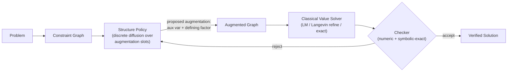

<div align="center">

# MARC

### **M**athematical **A**I **R**easoning **C**ore

*A learned structural prior over constraint graphs — neural proposals for **what to add** to a problem, classical solvers for the values, an exact checker for the truth.*

<br />

[](https://github.com/saidlaboratory/MARC)
[](#the-invention-ladder)
[](#motivation)
[](#)

<br />

**Quang Bui, Sparsh Roy, Akash Gundimeda, Davin Yin** · SAID Laboratory · July 2026

[Overview](#overview) · [What we measured](#what-we-measured-and-what-it-changed) · [The bet](#the-bet-division-of-labor) · [Invention ladder](#the-invention-ladder) · [Evaluation](#evaluation) · [Repo tour](#repo-tour) · [Prior art](#prior-art)

</div>

---

## Overview

> **MARC is an orchestrator, not a solver.**
> It represents a problem as a **constraint graph** and learns the one decision classical methods cannot make: **what structure to add** — the auxiliary variable, substitution, or defining relation that turns an unsolvable graph into a solvable one. Values are then found by classical solvers, and every answer must pass an exact symbolic checker.

The division of labor is the thesis:

| Decision | Who makes it | Why |
|---|---|---|
| **What structure to add** (auxiliary variable `d = x − y`, its defining factor, where it enters) | **Learned policy** (discrete diffusion over structure slots) | No gradient exists over this choice; enumeration is combinatorial; a learned prior amortizes it |
| **What values satisfy the constraints** | **Classical solvers** (Levenberg–Marquardt, Langevin refinement, exact linear solve) | Near-unbeatable on smooth algebraic systems — we measured it, twice |
| **Is the answer true** | **Exact checker** (numeric gate + symbolic-exact gate) | Verification is the only training signal and the only termination condition |

One sentence for the whole project: *MARC is a neural mathematician's instinct for "introduce `d = x − y`," bolted onto solvers that finish the job and a checker that keeps everyone honest.*

---

## What we measured, and what it changed

MARC v0.1 bet on **value diffusion**: a learned denoiser iteratively refining node *values* toward consistency. We tested that bet with pre-registered controls and it lost — publicly, with confidence intervals. The reframe is not a pivot away from evidence; it is what the evidence chose:

| Finding | Result | Consequence |
|---|---|---|
| **Noise reduces entrapment** (RQ2) | Deterministic descent traps 100% vs. 47.5% with Langevin noise; reduction 0.525 ± 0.086, N=200, CI excludes 0 | Real — but it argues for *stochasticity in search*, not for a learned denoiser |
| **Learned value proposals vs. random restart** (coupled families, R7) | Learned **ties or loses at every dimension** once solutions are coupled; the earlier high-dim win was a separability artifact | The "learned proposal beats classical search" route is **closed** |
| **Classical baseline strength** | Levenberg–Marquardt with restarts saturates the hard nonlinear families at 1.000 | Raw solve rate can never be MARC's claim |
| **GNN numerical capacity** | The denoiser could not overfit `Ax = b` on four fixed systems from raw coefficients | Propagating precise numbers through message passing is a structural limitation, not a tuning problem |
| **Structure selection** (trained policy over candidate augmentations) | Beats random-slot and no-context controls at small scale; clean-protocol regeneration pending | **The one learned component that beat its controls** — the live bet |

Full evidence ledger: [`paper/RESULTS.md`](paper/RESULTS.md) · every number's command/seed/commit: [`paper/PROVENANCE.md`](paper/PROVENANCE.md) · standing review-attack checklist: [`paper/REVIEW_ATTACKS.md`](paper/REVIEW_ATTACKS.md).

**Results integrity rules (house law):** classical solvers (`refine`, `lm`, `exact`) are always labeled baselines; every rate carries N and a Wilson CI; every comparison carries a z-test; structure-selection numbers are citable **only** from runs whose JSON records `seed_hygiene.overlap_instances: 0`. Numbers predating the seed-protocol fix are withdrawn and must not be cited.

---

## The bet (division of labor)

### Why structure, not values

Solving a constraint system involves two different kinds of decision:

- **Continuous:** *what values satisfy these equations.* Smooth, gradient-rich, and owned by sixty years of numerical analysis. Learning adds nothing here — our controls confirmed it.
- **Discrete:** *what representation makes the problem tractable at all.* Which auxiliary quantity to introduce, which substitution linearizes the system, which lemma bridges the gap. No gradient exists over this space; enumeration grows combinatorially; and classical solvers have **nothing** — a solver cannot decide to invent `d = x − y`.

A learned prior over the discrete space amortizes a cost that *grows* with problem difficulty: one forward pass versus exponentially many candidate-solve attempts. That economics is the opposite of the value-diffusion bet, whose advantage shrank as baselines got the same compute.

The external precedent is strong: **AlphaGeometry** (Nature, 2024) is exactly this architecture — a neural model proposes the auxiliary constructions no deduction engine can derive; a symbolic engine does the rest. MARC builds the same phenomenon in a **general constraint-graph substrate** rather than geometry-specific machinery.

### System at a glance



| Component | Role | Where |
|-----------|------|-------|
| **Constraint graph** | Variables + factor nodes (relations); the shared substrate | `marc/graph/` |
| **Structure policy** | Absorbing-D3PM reverse process over padded structure slots; proposes which augmentation to instantiate (ABSENT → active) and predicts its defining value | `marc/structure/` |
| **Classical value solvers** | Levenberg–Marquardt (`lm`), Langevin refinement (`refine`), exact linear (`exact`) — always the value-finders, always labeled baselines | `marc/refine/`, `marc/eval/solver.py` |
| **Checker** | Two-stage gate: numeric tolerance, then symbolic-exact acceptance; sole reward source and sole termination condition | `marc/cas/checker.py` |
| **CAS** | Exact residuals/energy/gradients (SymPy) | `marc/cas/` |

---

## The invention ladder

We climb from selection toward generation, one falsifiable rung at a time. Each rung keeps the same end-to-end verification: a proposal only counts if the augmented graph **actually solves and passes the checker**.

| Rung | What the policy does | Status |
|:---:|---|---|
| **1 · Menu selection** | Pick the correct augmentation from K procedurally generated candidates (exactly one solvable; hard negatives share the gold's structure with a wrong constant) | **Built + trained**; clean-protocol numbers pending the overnight run |
| **2 · Predicted defining value** | The policy's value head supplies the defining constant itself — the candidate space becomes continuous; the menu only provides insertion structure | **Built** (`predicted_pin`); evaluated as the `policy_value` arm |
| **3 · Compositional / multi-aux** | Choose insertion set and defining relation independently; multiple simultaneous auxiliaries (the padded-slot schema already supports >1 active slot) | Designed, not built |
| **4 · Free-form generation** | Emit the defining expression itself — invention proper | The prize; out of scope until rungs 1–3 hold |

**Naming discipline:** until rung 4, the honest term is **menu-based structure selection (with predicted defining value)** — "invention" appears only in code identifiers and in describing the ladder's endpoint.

**Problem families.** Aux-required families where the *fixed* graph is certifiably unsolvable and only the correct augmentation makes it solvable: linear patterns (`offset`/`coupled`/`shared`, exact rank certificates) and nonlinear patterns (`vieta`: `u = x − y`; `quad_link`: `u = x²`) with **empirical certificates** (a candidate is "unsolvable" iff a 12-restart solver probe fails — recorded per instance as an empirical claim, not a theorem). Gold insertion-structure is randomized per instance so family signatures can't be shortcut.

---

## Hypotheses (v0.2 — revised under evidence)

**H-Structure (the live bet).** A trained structural prior over constraint-graph augmentations selects/generates the representation change needed for solver success at above-control rates (vs. random slot, vs. no-graph-context, vs. always-none), transfers across held-out patterns, and does so at a fraction of enumeration cost — with the advantage growing as the candidate space grows.

**H-Value (resolved, negative).** Learned value proposals do not beat random multi-start on coupled systems (R7) and cannot beat LM anywhere we tested. We keep this result in every paper we write — it is the motivation, measured.

**Retained from v0.1:** verification-gated training (the checker is the only reward), procedural generation with *structural* holdout (train patterns ≠ test patterns, not just fresh constants), and derive-not-recall evaluation discipline.

---

## Evaluation

What we measure, per run (`scripts/run_invention_eval.py`):

| Metric | Question it answers |
|---|---|
| **Invention rate** vs. gold, + solve rate of the applied choice | Does the policy pick structure that *works end-to-end*? |
| **Random-slot / no-context / always-none controls** | Is it better than chance? Does it actually read the graph? |
| **Enumeration arm** (try every candidate, first accept wins) | The exact-solver ceiling — expected 1.00 — and its **cost** (solver calls, wall-clock) |
| **Amortization** (policy forwards + 1 solve vs. ~K/2 solves) | The economics of the bet, measured not asserted |
| **Cross-pattern holdout** (`--exclude-family`) | Generalization beyond memorizing a family's canonical augmentation |
| **Hard-negative confusion** | Is the policy reading constants, or matching insertion topology? |
| **Seed hygiene** (train/val/test ranges disjoint, asserted at load) | The eval refuses to run on contaminated seeds — protocol, not promise |
| Multi-seed pooled Wilson CIs + Holm-corrected comparisons | Statistical honesty by default |

Value-solver context rows (never headlines): `refine`, `lm`, `random`, `exact` on the hard/coupled suites, with the entrapment ablation retained as the RQ2 result.

**Reproduce everything:** `python3 scripts/run_overnight.py` (one command, crash-safe, per-phase logs + manifest; see [`RUNBOOK_SPARSH.md`](RUNBOOK_SPARSH.md)).

---

## Repo tour

```
marc/
  graph/       constraint-graph schema, PyG conversion
  cas/         SymPy residuals/energy/gradients + two-stage checker
  data/        procedural templates: linear, hard nonlinear, geometry,
               coupled chains, aux-required families (the invention data)
  structure/   THE CORE BET — padded slots, absorbing-D3PM corruption,
               invention menus + certificates, structure policy + reverse sampler
  refine/      classical Langevin refinement + residual Jacobians
  model/       GNN encoders (bipartite message passing), structure head
  diffusion/   value-diffusion machinery (retained: hybrid + ablations context)
  train/       Stage-A denoising, Stage-B GRPO (corrected), scale trainer (GPU/MPS),
               structure-policy training (CE + optional solve-reward)
  eval/        harness, metrics (Wilson/z/Holm), solver registry incl. lm/exact,
               structure evals
scripts/       run_overnight.py (the one command) + per-experiment scripts
paper/         RESULTS.md, PROVENANCE.md, REVIEW_ATTACKS.md, figures
```

---

## Prior art

| Line of work | Relationship to MARC |
|--------------|---------------------|
| **AlphaGeometry** (neural auxiliary constructions + symbolic engine) | The closest relative and the strongest precedent for the division of labor; MARC generalizes the pattern from geometry-specific machinery to arbitrary constraint graphs, with an exact checker in the loop |
| **Graph / discrete diffusion** (D3PM, DiGress) | The formalism for the structure policy: absorbing corruption over slots, learned reverse process; instantiation = ABSENT → active |
| **Neural algorithmic reasoning** | Independently documents why GNNs struggle with precise numerics — consistent with our `Ax=b` overfit failure and the delegation of values to classical solvers |
| **Neural / GNN constraint & SAT solvers** | Learned components inside search; MARC differs by learning the *representation change*, not the search itself |
| **RLVR & verifier-gated training** (GRPO, DeepSeek-R1) | The training discipline for both stages; reward only from the checker |
| **Tool-augmented computation** (PoT, PAL) | The reasoning/computation split, taken to its logical end: *all* computation is delegated |
| **Neurosymbolic & formal math** (Lean, AlphaProof) | The verifier-centric, derive-not-recall philosophy MARC retains from v0.1 |

---

## Success criteria

**Supported** if the structure policy, under the clean seed protocol, (a) beats random-slot and no-context controls with Holm-corrected significance on nonlinear aux-required families, (b) holds on cross-pattern holdout, and (c) approaches the enumeration ceiling at a measured fraction of its cost — with the cost gap widening as K grows.

**Falsified** if the no-context ablation matches the full policy (the model isn't reading the graph), or cross-pattern transfer collapses to chance (it memorizes family signatures), or the amortization advantage disappears at realistic K.

Either outcome is publishable. That is the point of the protocol.

---

<div align="center">

<br />

*v0.2 · The founding value-diffusion framing is preserved in [CONCEPT.md](CONCEPT.md); the evidence that forced this reframe is in [paper/RESULTS.md](paper/RESULTS.md).*

**SAID Laboratory** · [saidlaboratory/MARC](https://github.com/saidlaboratory/MARC)

</div>
