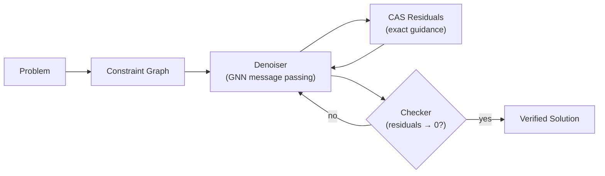
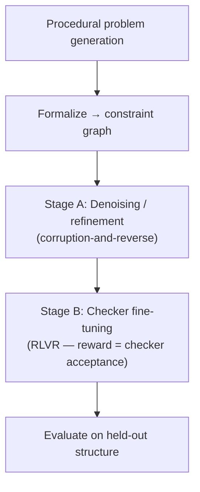

<div align="center">

# MARC

### **M**athematical **A**I **R**easoning **C**ore

*Denoising diffusion over constraint graphs for verifiable mathematical reasoning*

<br />

[](https://github.com/saidlaboratory/MARC)
[](#roadmap)
[](#motivation)
[](#)

<br />

**Quang Bui, Sparsh Roy, Akash Gundimeda, Davin Yin** · SAID Laboratory · June 2026

[Overview](#overview) · [Approach](#approach) · [Roadmap](#roadmap) · [Evaluation](#evaluation) · [Prior Art](#prior-art)

</div>

---

## Overview

> **MARC does not reason by emitting a left-to-right chain of tokens.**  
> It represents a problem as a **constraint graph** and solves it by **iteratively denoising that graph toward a globally consistent state** — a learned, stochastic relaxation in which each refinement step is a round of message passing over the graph.

The design intent is a model that *derives* answers under verification rather than *recalls* them, spending learned capacity on mathematical structure instead of brittle token-level arithmetic.

### The central bet

MARC fuses two reasoning paradigms into one mechanism:

| Paradigm | What it contributes |
|----------|---------------------|
| **Constraint-graph relaxation** | A structured, checkable object to refine |
| **Denoising diffusion** | Stochastic exploration that escapes locally-consistent-but-globally-wrong fixed points |

Together: **denoising diffusion over a constraint graph.**

### System at a glance



| Component | Role |
|-----------|------|
| **Constraint graph** | Structured representation of variables and relations |
| **Denoiser (GNN)** | Iterative refinement via message passing |
| **CAS** | Exact per-constraint residuals as guidance signal |
| **Checker** | Terminal gate at inference; sole training reward source |

---

## Motivation

Current LLM mathematical reasoning is dominated by chain-of-thought (CoT) post-trained with reinforcement learning from verifiable rewards (RLVR). This works — but three problems motivate a different substrate:

| Problem | Why it matters |
|---------|----------------|
| **Memorization & contamination** | Benchmark performance often reflects exposure to solutions, not genuine derivation |
| **Faithfulness** | Verbalized chains frequently post-hoc rationalize the answer rather than reflect actual computation |
| **Arithmetic brittleness** | Token-level models compute poorly; CoT capacity is consumed tracking digits, not structure |

> CoT is *not* mere retrieval — its intermediate tokens act as a scratchpad that extends effective compute depth. MARC's goal is not to remove reasoning, but to **relocate** computation into a structured, verifiable substrate and **offload** mechanical arithmetic to an exact engine.

**Why mathematics first.** Answers and derivations are *verifiable*. A CAS or proof kernel supplies objective signal with no human annotation — the tightest possible loop between generation and verification.

---

## Hypotheses

<table>
<tr>
<td width="50%" valign="top">

**H1 — Derive, don't recall**

A model that refines a structured constraint graph toward checker-verified consistency will generalize to unseen problem structure better than a token-level CoT model of comparable scale, because it cannot fall back on recalling token sequences.

</td>
<td width="50%" valign="top">

**H2 — Invent intermediate objects**

Allowing the refinement process to modify the graph's *structure* (not only its values) enables the system to introduce auxiliary quantities, lemmas, and substitutions that a fixed constraint network cannot express.

</td>
</tr>
</table>

### Research questions

1. Can learned, noise-driven iterative refinement of a constraint graph reliably converge to checker-accepted solutions?
2. Does injected noise reduce entrapment in inconsistent local fixed points vs. deterministic message passing?
3. What corruption process and noise schedule suit the discrete/symbolic parts of a constraint graph?
4. Is full probabilistic diffusion necessary, or does *learned iterative refinement with injected noise* suffice?
5. Does training only against a checker (no reference solutions) yield derive-not-recall behavior?

---

## Approach

### 1 · Representation — the constraint graph

A problem is encoded as a (hyper)graph with two node types:

```
  [x]──────[eq₁: x + y = 5]──────[y]
                │
           [eq₂: x² + y² = 13]
                │
              [z]  ← variable node (known or unknown)
```

- **Variable nodes** — quantities and objects, each carrying a current (possibly noisy) value or embedding
- **Factor nodes** — relations the solution must satisfy: equations, inequalities, identities, applicability conditions

The clean target is a fully consistent assignment where every factor's residual is zero. Consistency is a **global** property — no privileged step order.

### 2 · The denoiser — message passing as refinement

The refinement operator is a graph neural network. One step = one round of message passing, trained as a **denoiser**: given a corrupted graph, it produces an update toward a consistent configuration.

> Message passing and denoising are the same operation — local updates propagated over a structure and iterated to convergence — described in two vocabularies. MARC uses one to implement the other.

### 3 · Guidance — the calculator (CAS)

At each step, the CAS computes the **exact residual** of every factor. These residuals steer denoising toward the constraint surface — the analogue of classifier guidance in conditional diffusion. The model never performs arithmetic itself; it learns *which* constraints to attack and *how* to move.

### 4 · Termination — the checker

Denoising continues until residuals vanish and a formal/symbolic checker accepts the candidate. Failed samples are resampled or refined — verification makes best-of-N safe and cheap.

### Two variants

| Variant | Scope | Status |
|---------|-------|--------|
| **Value diffusion** | Fixed topology; only node *values* are noised and denoised | **MVP — build first** |
| **Structure diffusion** | Graph topology is also noised: edges and intermediate nodes added/removed | Ambitious extension — tests H2 |

---

## MVP example

**Problem:** Nonlinear system in unknowns `x, y, z`.

| Step | What happens |
|------|--------------|
| **Encode** | One variable node per unknown/constant; one factor node per equation |
| **Corrupt** | Start from a valid assignment; add scheduled Gaussian noise to values |
| **Denoise** | GNN takes noisy graph + CAS residuals; predicts update; iterate high → low noise |
| **Verify** | Stop when residuals vanish; checker confirms every equation is satisfied |

The same template extends to geometry (coordinates as variables, relations as factors) and word problems once parsed into quantities and relations.

---

## Training



**Data.** Procedurally generated problems with known solutions, formalized into constraint graphs. Procedural generation is essential: it lets us hold out *structure*, not just specific numbers.

| Stage | Objective |
|-------|-----------|
| **A — Denoising** | Train GNN by corruption-and-reverse on valid graphs (score matching or simpler iterative refinement with noise) |
| **B — Checker fine-tuning** | RLVR (e.g. GRPO) rewarding only checker-accepted derivations — no reference solution required |

**Anti-memorization design.** Evaluate on held-out problem *structure*; test length and compositional generalization (train small, test large); perturb constants so memorized answers fail. Only a real procedure generalizes.

---

## Evaluation

### Capability metrics

Solve rate (pass@1, pass@k) on formalizable suites — grade-school and competition word problems, algebra, equation systems, geometry — plus internal synthetic suites with controllable structure.

### Hypothesis-testing metrics *(more important than raw solve rate)*

| Metric | Tests |
|--------|-------|
| **Generalization gap** | In-distribution vs. held-out structure / larger size → H1 |
| **Constant perturbation robustness** | Recall detector |
| **Length / compositional extrapolation curves** | Procedure vs. memorization |
| **Derivation verifiability rate** | Checker accepts full derivation, not just final value |
| **Entrapment rate** | Stalls at nonzero-residual fixed points, with/without noise → RQ2 |
| **Intermediate-object usage** | Auxiliary nodes/lemmas on otherwise-unsolvable problems → H2 |

---

## Roadmap

```
P0 ──► P1 ──► P2 ──► P3 ──► P4
 infra   MVP    RLVR   struct  scale
```

| Phase | Focus | Target |
|:-----:|-------|--------|
| **P0** | Infrastructure | Graph schema, problem generator, CAS interface, checker, corruption utilities, eval harness |
| **P1** | Value-diffusion MVP | Fixed-structure diffusion on equations and simple algebra; first length-generalization curves |
| **P2** | Checker fine-tuning | RLVR against checker; derive-not-recall via generalization and perturbation metrics |
| **P3** | Structure diffusion | Graph-growing; intermediate-object invention; test H2 |
| **P4** | Scope & scale | Broaden domains; NL parser/autoformalizer; scale model and data |

---

## Risks & open questions

<details>
<summary><strong>Discrete graph diffusion is hard</strong> — structure diffusion (P3) is the riskiest component</summary>

Corruption processes and noise schedules over discrete/symbolic structure are not well understood. Build value diffusion first; treat P3 as research, not engineering.
</details>

<details>
<summary><strong>Diffusion machinery may be overkill</strong> — noise for exploration may suffice</summary>

Validate whether plain learned iterative refinement with injected noise captures the benefit before committing to full SDE/score-matching formalism.
</details>

<details>
<summary><strong>Autoformalization bottleneck</strong> — NL → constraint graph is its own hard subproblem</summary>

Deferred to P4. Early phases use problems generated directly in graph form to de-risk the core mechanism.
</details>

<details>
<summary><strong>Calculator fixes arithmetic, not strategy</strong></summary>

The CAS removes a bounded class of errors. Most hard-problem failures are reasoning/strategy errors — the interesting capacity stays in the denoiser's decisions.
</details>

<details>
<summary><strong>Expressiveness ceiling without structure diffusion</strong></summary>

A fixed constraint graph cannot represent open-ended proof or solutions requiring new objects. Until P3 works, scope claims are "solve for a consistent state," not "prove arbitrary statements."
</details>

<details>
<summary><strong>Specialization, not lobotomy</strong></summary>

A math-only model from scratch loses language ability to parse problems. Favor heavy specialization (continued pretraining on formal + informal math) over a math-only model.
</details>

<details>
<summary><strong>Multiple valid solutions / identifiability</strong></summary>

Diffusion naturally samples one of several valid configurations — acceptable and leverageable for diverse derivations, but evaluation must account for it.
</details>

---

## Prior art

MARC's individual components are precedented; the contribution is their **specific combination as a mathematical reasoning engine**, plus structure-denoising for intermediate-object invention and train-only-against-a-checker discipline.

| Line of work | Relationship to MARC |
|--------------|---------------------|
| **Graph / discrete diffusion** (DiGress-style) | Machinery for denoising graph structure; not previously used as a math reasoning substrate |
| **Neural / GNN constraint & SAT solvers** | Message passing and diffusion as solvers; MARC adds exact CAS guidance and formal checker |
| **RLVR & process rewards** (GRPO, DeepSeek-R1, PRMs) | Verifiable-reward training paradigm for Stage B |
| **Latent reasoning** (CoT, Coconut, recurrent-depth) | Reasoning off the token stream; MARC's graph is a *structured, checkable* latent |
| **Neurosymbolic & formal math** (Lean, AlphaProof, DeepSeek-Prover) | Verifier-centric, derive-not-recall philosophy |
| **Tool-augmented computation** (PoT, PAL) | Reasoning/computation split that CAS offload instantiates |
| **Numerical representation** (Abacus, xVal, FoNE) | How variable-node values are encoded |

---

## Success criteria

**Supported** if, at comparable scale, value-diffusion (P1–P2) shows a **smaller generalization gap and greater perturbation robustness** than a token-level CoT baseline, with high derivation-verifiability rate. Structure-diffusion (H2) is supported if graph-growing solves problems requiring auxiliary objects that fixed-structure cannot, with measurable intermediate-object usage.

**Falsified** if: injected noise does not reduce entrapment (RQ2 fails); generalization gap is no better than CoT (H1 fails); or structure diffusion never converges and yields no object-invention benefit (H2 fails) despite a stable value-diffusion base.

---

<div align="center">

<br />

*Living document — sections on approach and training are the first items to pin down before P0.*

**SAID Laboratory** · [saidlaboratory/MARC](https://github.com/saidlaboratory/MARC)

</div>
