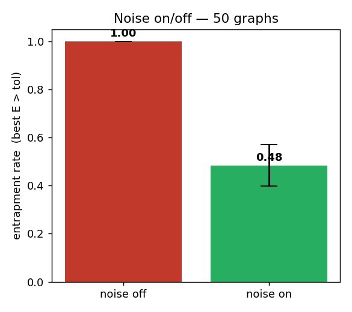
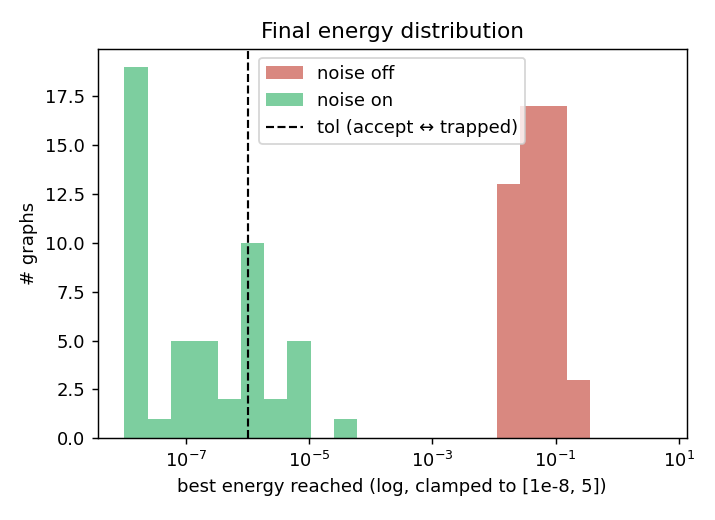
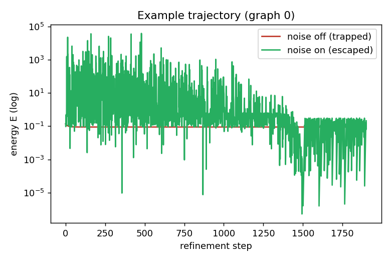

# P1 — Noise On/Off Entrapment Ablation (RQ2)

✅ **Noise reduces entrapment.** Injected noise lowers the entrapment rate by **0.52 ± 0.09** (95% CI excludes 0). The core RQ2 hypothesis holds on this suite.

## What this measures

Energy-gradient iterative refinement (TECHNICAL_GUIDE §3.4) is run on
**50** nonconvex problems whose starts sit inside a spurious,
locally-consistent-but-globally-wrong basin. With **noise off** the update is plain
gradient descent — the deterministic constraint-relaxation baseline (§11) — which is
trapped by construction. With **noise on** the same update gains an annealed Langevin
term that can cross the energy barrier to the true solution.

A run is **entrapped** when the best energy it ever reaches stays above
`tol = 1e-06` (it never found a solution the checker would accept).

* Solver config: `{'steps': 1500, 'lr': 0.02, 'sigma0': 2.5, 'anneal': True}`
* Seeds (noise-on, for the CI): `[0, 1, 2, 3, 4]`

## Results

| Arm | Entrapment rate |
|---|---|
| noise **off** (deterministic) | **1.000** |
| noise **on** (mean over 5 seeds) | **0.484 ± 0.086** |
| **Entrapment reduction (off − on)** | **0.516 ± 0.086** |

Per-seed noise-on entrapment rates: [0.34, 0.44, 0.52, 0.52, 0.6]

## Figures

## Interpretation

The deterministic relaxation stalls at the spurious fixed point on every graph
(entrapment = 1.00), exactly the failure mode §4 attributes to "deterministic
message passing." Injected noise lets the relaxation escape and reach the global
solution on a substantial fraction of graphs, cutting entrapment to 0.48. This is
the load-bearing evidence for RQ2: **the noise is doing real work.**

This ablation uses the exact energy gradient as a stand-in for the learned denoiser
`g_theta`. When Davin's learned `solve()` lands it slots into the same `Solver`
contract (`marc.eval.solver`); re-running this script then measures whether the
*learned* refinement preserves the noise benefit.
